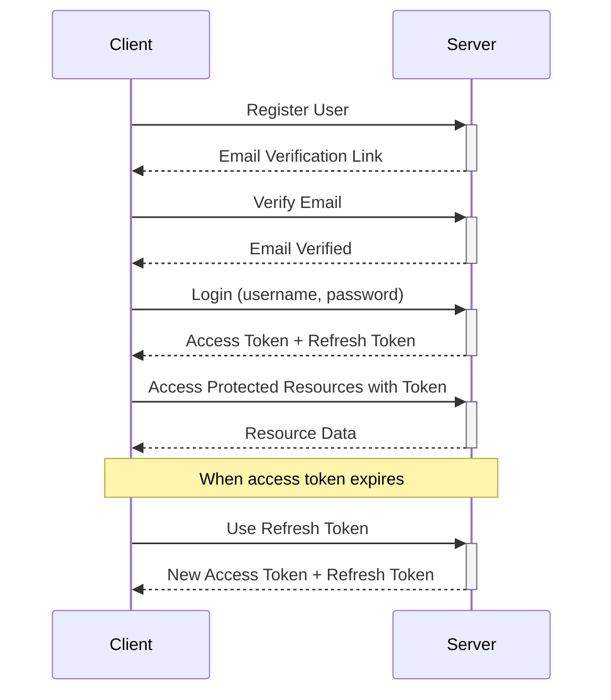

# FastAPI JWT Authentication

<p align="center">
  
  
  
  
</p>

<div align="center">
  <h3>
    <a href="#features">Features</a> •
    <a href="#installation">Installation</a> •
    <a href="#api-documentation">API Docs</a> •
    <a href="#testing">Testing</a> •
    <a href="#português">Português</a>
  </h3>
</div>

A comprehensive authentication system built with FastAPI, featuring JWT tokens, refresh tokens, role-based access control, email verification, and more.

## Features

- 🔐 **Secure Authentication** with JWT tokens
- 🔄 **Refresh Token Mechanism** for seamless user experience
- 👮 **Role-Based Access Control** (Admin, User, Guest roles)
- ✉️ **Email Verification** for new accounts
- 🔑 **Password Reset** functionality
- 🛡️ **Rate Limiting** to prevent brute force attacks
- 📊 **Audit Logging** for tracking authentication events
- 🧪 **Comprehensive Test Suite** with pytest
- 🐳 **Docker Support** for easy deployment
- 🔄 **CI/CD Pipeline** with GitHub Actions

## Architecture


### Authentication Flow



## Installation

### Prerequisites

- Python 3.10+
- pip
- Docker & Docker Compose (optional for containerized deployment)

### Local Development

1. Clone the repository:
```bash
git clone https://github.com/username/fastapi-jwt-authentication.git
cd fastapi-jwt-authentication
```

2. Create a virtual environment and install dependencies:
```bash
python -m venv venv
source venv/bin/activate  # On Windows: venv\Scripts\activate
pip install -r requirements.txt
```

3. Run the application:
```bash
uvicorn app.main:app --reload
```

### Docker Deployment

1. Build and run with Docker Compose:
```bash
docker-compose up -d
```

2. Check the application status:
```bash
docker-compose ps
```

## Environment Variables

Create a `.env` file in the root directory with the following variables:

```env
# JWT Configuration
JWT_SECRET_KEY=your_super_secret_key_here
JWT_ALGORITHM=HS256
ACCESS_TOKEN_EXPIRE_MINUTES=30
REFRESH_TOKEN_EXPIRE_DAYS=7

# Email Configuration
EMAIL_TOKEN_EXPIRE_HOURS=24
RESET_TOKEN_EXPIRE_HOURS=1
FRONTEND_URL=http://localhost:3000
MAIL_USERNAME=your_email@gmail.com
MAIL_PASSWORD=your_app_password
MAIL_FROM=noreply@example.com
MAIL_FROM_NAME=FastAPI JWT Auth
MAIL_PORT=587
MAIL_SERVER=smtp.gmail.com
MAIL_STARTTLS=True
MAIL_SSL_TLS=False
MAIL_USE_CREDENTIALS=True

# Database Configuration
DATABASE_URL=sqlite:///./app.db
```

## API Documentation

Once the application is running, access the API documentation at:

- Swagger UI: http://localhost:8000/docs
- ReDoc: http://localhost:8000/redoc

### Authentication Endpoints

| Method | Endpoint | Description | Request Body | Response |
|--------|----------|-------------|--------------|----------|
| POST | `/auth/register` | Register new user | `{"username": "user", "email": "user@example.com", "password": "password123", "role": "USER"}` | User object |
| POST | `/auth/login` | Login | `{"username": "user", "password": "password123"}` | Access & refresh tokens |
| POST | `/auth/refresh` | Refresh token | `{"refresh_token": "token"}` | New access & refresh tokens |
| POST | `/auth/logout` | Logout | `{"refresh_token": "token"}` | Success message |
| POST | `/auth/logout/all` | Logout from all devices | - | Success message |
| POST | `/auth/verify-email` | Verify email | `{"token": "verification_token"}` | Success message |
| POST | `/auth/password-reset/request` | Request password reset | `{"email": "user@example.com"}` | Success message |
| POST | `/auth/password-reset/confirm` | Confirm password reset | `{"token": "reset_token", "new_password": "newpassword123"}` | Success message |
| POST | `/auth/resend-verification` | Resend verification email | - | Success message |

### User Endpoints

| Method | Endpoint | Description | Authorization | Response |
|--------|----------|-------------|---------------|----------|
| GET | `/users/me` | Get current user | Bearer token | User object |
| GET | `/users` | List all users | Bearer token (USER/ADMIN) | Array of users |

### Admin Endpoints

| Method | Endpoint | Description | Authorization | Request | Response |
|--------|----------|-------------|---------------|---------|----------|
| PUT | `/users/{user_id}/role` | Update user role | Bearer token (ADMIN) | `role` query param | Updated user |
| PUT | `/users/{user_id}/activate` | Activate user | Bearer token (ADMIN) | - | Updated user |
| PUT | `/users/{user_id}/deactivate` | Deactivate user | Bearer token (ADMIN) | - | Updated user |
| GET | `/audit-logs` | Get all audit logs | Bearer token (ADMIN) | Optional query params | Array of logs |
| GET | `/audit-logs/user/{user_id}` | Get user audit logs | Bearer token (ADMIN) | - | Array of logs |
| GET | `/audit-logs/types` | Get audit log types | Bearer token (ADMIN) | - | Array of types |

### Example API Usage with cURL

**Register a new user:**
```bash
curl -X POST http://localhost:8000/auth/register \
  -H "Content-Type: application/json" \
  -d '{"username": "testuser", "email": "test@example.com", "password": "password123"}'
```

**Login:**
```bash
curl -X POST http://localhost:8000/auth/login \
  -H "Content-Type: application/x-www-form-urlencoded" \
  -d "username=testuser&password=password123"
```

**Access protected endpoint:**
```bash
curl -X GET http://localhost:8000/users/me \
  -H "Authorization: Bearer YOUR_ACCESS_TOKEN"
```

## Testing

Run the test suite:
```bash
pytest
```

Run with coverage:
```bash
pytest --cov=app tests/
```

Generate coverage report:
```bash
pytest --cov=app --cov-report=html tests/
```

### Testing Authentication Flow

The test suite includes tests for:
- User registration and validation
- Login/logout processes
- Token refresh mechanisms
- Email verification
- Password reset
- Role-based access control
- Rate limiting and security features
- Audit logging

## Project Structure

```
fastapi-jwt-authentication/
│
├── app/                          # Main application package
│   ├── __init__.py
│   ├── audit.py                  # Audit logging functionality
│   ├── auth.py                   # Authentication logic
│   ├── config.py                 # Configuration settings
│   ├── database.py               # Database connections
│   ├── email.py                  # Email sending functionality
│   ├── main.py                   # FastAPI application and routes
│   ├── models.py                 # SQLAlchemy models
│   ├── schemas.py                # Pydantic schemas
│   ├── security.py               # Security utilities
│   └── email_templates/          # Email HTML templates
│       ├── email_verification.html
│       └── password_reset.html
│
├── tests/                        # Test package
│   ├── __init__.py
│   ├── conftest.py               # Test fixtures
│   ├── test_auth.py              # Authentication tests
│   ├── test_roles.py             # Role-based access tests
│   ├── test_audit.py             # Audit logging tests
│   └── test_users.py             # User management tests
│
├── .github/                      # GitHub configuration
│   └── workflows/                # GitHub Actions workflows
│       └── main.yml              # CI/CD workflow
│
├── .gitignore                    # Git ignore file
├── Dockerfile                    # Docker configuration
├── docker-compose.yml            # Docker Compose configuration
├── requirements.txt              # Python dependencies
├── app.db                        # SQLite database
└── README.md                     # Project documentation
```

---

## Português

# Autenticação FastAPI com JWT

Um sistema completo de autenticação construído com FastAPI, com tokens JWT, refresh tokens, controle de acesso baseado em funções, verificação de e-mail e muito mais.

## Funcionalidades

- 🔐 **Autenticação Segura** com tokens JWT
- 🔄 **Mecanismo de Refresh Token** para experiência contínua do usuário
- 👮 **Controle de Acesso Baseado em Funções** (Admin, Usuário, Convidado)
- ✉️ **Verificação de E-mail** para novas contas
- 🔑 **Funcionalidade de Recuperação de Senha**
- 🛡️ **Limitação de Taxa** para prevenir ataques de força bruta
- 📊 **Registro de Auditoria** para rastreamento de eventos de autenticação
- 🧪 **Suíte de Testes Abrangente** com pytest
- 🐳 **Suporte para Docker** para implantação fácil
- 🔄 **Pipeline CI/CD** com GitHub Actions

## Instalação

### Desenvolvimento Local

1. Clone o repositório:
```bash
git clone https://github.com/username/fastapi-jwt-authentication.git
cd fastapi-jwt-authentication
```

2. Crie um ambiente virtual e instale as dependências:
```bash
python -m venv venv
source venv/bin/activate  # No Windows: venv\Scripts\activate
pip install -r requirements.txt
```

3. Execute a aplicação:
```bash
uvicorn app.main:app --reload
```

### Implantação com Docker

1. Construa e execute com Docker Compose:
```bash
docker-compose up -d
```

## Variáveis de Ambiente

Configure estas variáveis de ambiente para uso em produção:

- `JWT_SECRET_KEY`: Chave secreta para geração de token JWT (obrigatória)
- `ACCESS_TOKEN_EXPIRE_MINUTES`: Tempo de expiração para tokens de acesso (padrão: 30)
- `REFRESH_TOKEN_EXPIRE_DAYS`: Tempo de expiração para tokens de atualização (padrão: 7)
- `DATABASE_URL`: String de conexão do banco de dados (padrão: SQLite)
- `MAIL_USERNAME`: Nome de usuário SMTP para envio de e-mails
- `MAIL_PASSWORD`: Senha SMTP
- `MAIL_FROM`: Endereço de e-mail remetente
- `MAIL_SERVER`: Endereço do servidor SMTP (padrão: smtp.gmail.com)
- `MAIL_PORT`: Porta SMTP (padrão: 587)
- `FRONTEND_URL`: URL da aplicação frontend para links de e-mail

## Documentação da API

Depois que a aplicação estiver em execução, acesse a documentação da API em:

- Swagger UI: http://localhost:8000/docs
- ReDoc: http://localhost:8000/redoc

### Exemplo de Uso da API

**Registrar um novo usuário:**
```bash
curl -X POST http://localhost:8000/auth/register \
  -H "Content-Type: application/json" \
  -d '{"username": "testuser", "email": "test@example.com", "password": "password123"}'
```

**Login:**
```bash
curl -X POST http://localhost:8000/auth/login \
  -H "Content-Type: application/x-www-form-urlencoded" \
  -d "username=testuser&password=password123"
```

**Acessar endpoint protegido:**
```bash
curl -X GET http://localhost:8000/users/me \
  -H "Authorization: Bearer SEU_TOKEN_DE_ACESSO"
```

## Testes

Execute a suíte de testes:
```bash
pytest
```

Execute com cobertura:
```bash
pytest --cov=app tests/
```

## Licença

MIT
